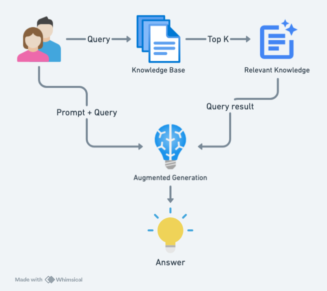
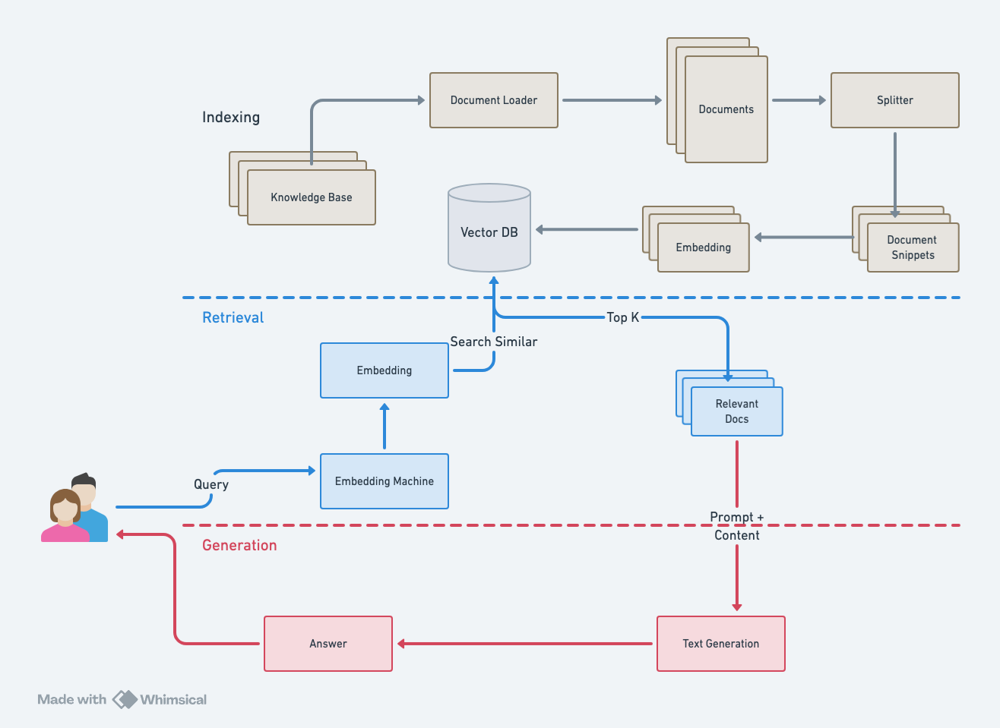

# chattyyogi
A specialized custom Language Learning Model (LLM) knowledge base was meticulously developed to answer yoga-related questions. This innovative solution leverages entirely free, open-source APIs and frameworks, ensuring cost-effectiveness and accessibility. The knowledge base generates answers exclusively from a curated collection of yoga textbooks that have been meticulously inputted into the system, ensuring that the information is both accurate and authoritative.

## High-Level Design Overview
- ChattiYogi uses Qdrant (free tier) to build a robust knowledge base.
- It employs Hugging Face's free inferencing service for generating responses.

## How It Works
- **Query Handling**: When a user asks a question, it first queries the knowledge base to search for relevant documents.
- **Document Retrieval**: The system pulls the top five similar documents from the knowledge base.
- **Response Generation**: The retrieved documents, along with the user's question and a predefined prompt, are passed to the LLM model.
- **Ensuring Safety**: The model generates a final answer that is friendly, kind, and free from any discriminatory or offensive content towards any group or ethnicity.

## System Design for Indexing, Retrival and Generation

## Steps for Vector DB Indexing

### 1. Load All Yoga Textbooks as Knowledge Base
To begin, gather and load all the Yoga textbooks that will serve as the knowledge base for the project. Ensure all relevant documents are accessible for processing. This step involves:

- Collecting all the Yoga textbooks in a specified directory.
- Loading the contents of each textbook into the system for further processing.

### 2. Split All Documents into Chunks
Next, split the loaded documents into manageable chunks. This helps in better indexing and retrieval. The splitting process includes:

- Tokenizing the documents into smaller sections (chunks) while maintaining the coherence of each section.
- Setting a maximum chunk size to ensure each chunk is of an appropriate length for embedding.
- Collecting all the chunks into a list for the next processing step.

### 3. Use FastEmbed for Embedding and Store in Vector DB
Finally, convert the text chunks into embeddings using FastEmbedding, and store them in the vector database (Qdrant). This step involves:

- Initializing the FastEmbed model to encode the text chunks into vector representations.
- Generating embeddings for each chunk, ensuring they accurately represent the content.
- Initializing the Qdrant client and creating a new collection to store the embeddings.
- Storing the embeddings in the Qdrant vector database with appropriate metadata to facilitate efficient retrieval.

### Detailed Steps

1. **Loading Yoga Textbooks**:
    - Identify the directory where all Yoga textbooks are stored.
    - Read the content of each textbook into memory, ensuring no data is missed.

2. **Splitting Documents**:
    - Tokenize the content into sentences or paragraphs.
    - Group sentences or paragraphs into chunks with a maximum size to ensure they are manageable.
    - Store the chunks in a list for the embedding process.

3. **Embedding and Storing**:
    - Initialize the FastEmbedding model with the appropriate parameters.
    - Generate embeddings for each chunk.
    - Initialize the Qdrant client and create a collection if it doesn’t exist.
    - Upsert the embeddings into the Qdrant vector database with associated metadata such as chunk content and identifiers.

## Summary
By following these detailed steps, we successfully:
1. Loaded Yoga textbooks into a knowledge base.
2. Split the documents into chunks for better management.
3. Embedded the chunks using FastEmbedding and stored the resulting vectors in Qdrant.

Below few screenshot of application 

## Welcome Page, Who are you?

## Recommend Asanas

## Error Handling

